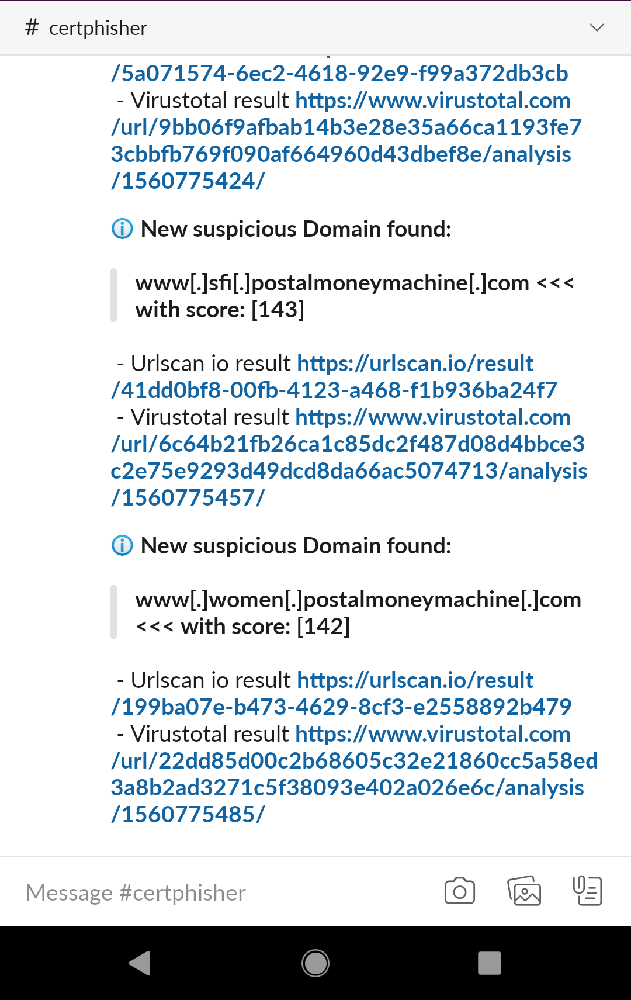
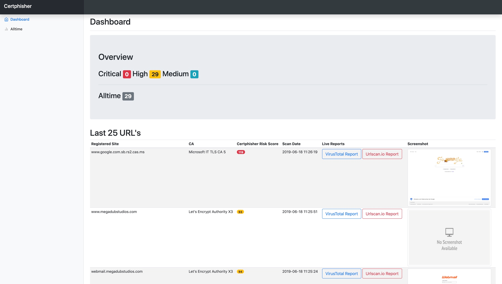
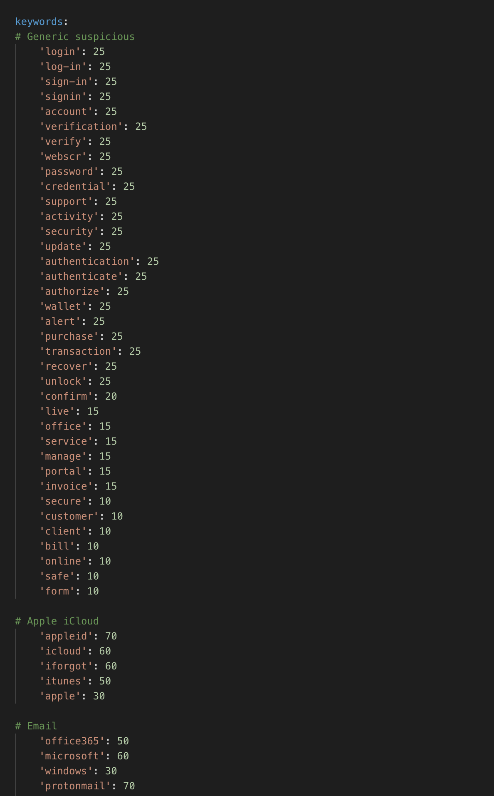

# Certphisher
This is a fork of [@x0rz's](https://twitter.com/x0rz) awesome [phishing_catcher](https://github.com/x0rz/phishing_catcher).
I've updated his scoring engine with a submit functionality to VirusTotal, urlscan.io who fetches the response to a mongodb + flask frontend with slack integration for later review.

Feel free to modify, tweak the code. 

## TLDR; Container ftw
Thanks to [plonxyz](https://twitter.com/plonxyz) there is a dockerized version as well [certphisher-dockerized](https://github.com/joelgun-xyz/certphisher-dockerized/)


## Getting Started

Clone the Git Repo to your local machine and make sure you have python3 installed. 

```
git clone https://github.com/joelgun-xyz/certphisher.git 
```

### Prerequisites

#### Get API Keys from

* [VirusTotal](https://developers.virustotal.com/reference)  -  It's free for not more than 4 Requests pre minute. 
  The script has an implemented delay of 26 secs per submit. 
* [urlscan.io](https://urlscan.io/about-api/)  - also free


Install mongodb if not already installed. 

* https://docs.mongodb.com/manual/administration/install-community/ 

No need to initialise a collection, it will be created automatically. 

Go to the cloned directory and install the libs from the requirements.txt

```
pip3 install -r requirements.txt
```

### Installing

Edit the **default-config.ini** with your API keys and rename it to **config.ini**.

```
; config.ini
[apikeys]
vt_key = XXXXXXXXXXXXXXXXXXXXXXXXXXXXXXXXXXXXXXXXXXXXXXXXXXXx
urlscan_key = XXXXXXXXXXXXXXXXXXXXXXXXXXXXXXXXXXXXXXXXXXXXXXXXXXXx


[mongodb]
my_instance = mongodb://localhost:27017/
my_db = certphisher
my_col = sites
username = foo
password = bar

[slack]
integration = 1
bot_key = XXXXXXXXXXXXXXXXXXXXXXXXXXXXXXXXXXXXXXXXXXXXXXXXXXXx
channel = XXXXXXXXXXXXXXXXXXXXXXXXXXXXXXXXXXXXXXXXXXXXXXXXXXXx
relevant_score = 140
```

#### Slack Notifications

If you don't want or don't have yet a slack channel you can create one here: 

* [Slack API](https://api.slack.com/slack-apps)

or disable this feature in the config.ini file with this line: 
```
slack_integration = 0
```

If you want to be notified about newly registered and high scored domains, 
you can adjust the score depending on your rating system when to fire a notification in your slack channel.  

```
relevant_score = 140
```


If you enable notifications, it should look like this:





## Usage 


* Start your mongodb. 
(Check if the host and port is the same as in the config.ini)

  (Depending on the OS)

* Start the backend engine with.  

  ```
  python3 main.py
  ```

* Start the frontend 
  (Currently running on the flask server, feel free to migrate to fully productive server like nginx)
  go to ./app directory from certphisher
  
  ```
  cd ./app && $ export FLASK_APP=app.py && $ flask run

  ```  
  You should to see something like this in your console.
  
  ```
   * Environment: production
     WARNING: Do not use the development server in a production environment.
     Use a production WSGI server instead.
   * Debug mode: off
   * Running on http://127.0.0.1:5000/ (Press CTRL+C to quit)
  ```
  **The frontend should be served over http://127.0.0.1:5000/**

Your Dashboard will look similar to this:



### Change Scoring 

Just the add / change the values in the files suspicious.yaml or external.yaml with your own keyword / scores if you want to customize it. 




## Example Dataset

This is an example database entry. 

```
{ "_id" : ObjectId("5d08c94532ff3eada0b5f933"), "certphisher_site" : "microsoftmail.info", "certphisher_score" : 111, "certificate_authority" : "Let's Encrypt Authority X3", "checked_vt" : "true", "vt_report_saved" : "false", 
"urlhaus" : { "url_check" : { "query_status" : "no_results" } }, "virus_total" : { "permalink" : "https://www.virustotal.com/url/0d3d3e7beb3a3b5f76d69f763e4f208364d5b75382f1a06cc9218896e5f5fd43/analysis/1560856927/", 
"resource" : "https://microsoftmail.info/", "url" : "https://microsoftmail.info/", "response_code" : 1, "scan_date" : "2019-06-18 11:22:07", "scan_id" : "0d3d3e7beb3a3b5f76d69f763e4f208364d5b75382f1a06cc9218896e5f5fd43-1560856927", 
"verbose_msg" : "Scan request successfully queued, come back later for the report" }, 
"urlscan_permalink" : "https://urlscan.io/result/00bf844a-1f54-40c7-bf69-beea41882092", "urlscan_uuid" : "https://urlscan.io/screenshots/00bf844a-1f54-40c7-bf69-beea41882092" }

```


## Authors

* **joelgun** - [Twitter](https://twitter.com/joelgun)


## Acknowledgments

* heywoodlh - for the great urlscan.io python wrapper [Github](https://github.com/heywoodlh/urlscan-py)


